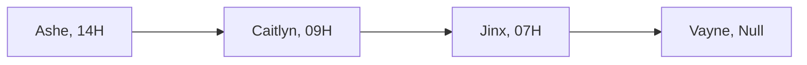

#### Linked List Basics
- A `linked list` is used for storing a collection of data where each element is a separate object.
- Elements in a linked list are called `nodes`.
- The parts of a node are the following:

| **Data** | **Pointer** |
| ---- | ------- |

   - **Data Field** - This contains the value of the element.
   - **Pointer Field** `link or reference`-  This contains the address `(random memory location)` of the next node.
- The next node in the list is referred to as the `successor`.
- The first node in the list is called `head`.
- The last node points to `null` since there are no more successive elements.


- A `linked list` is illustrated by:
   - Placing the address of the node above its data field
   - Placing the address of the next node in the node's pointer field
   - Indicating *null* in the pointer field of the last node using an arrow to the right.
- Operations of a linked list:
   - **Display** - Shows the elements in the list
   - **Insert** - Adds an element into the list
   - **Delete** - Removes a specific element or all the elements from the list
   - **Search** - Finds a specific element in the list
   - **Count** - Returns the number of elements in the list

##### Linked List vs Array
- **Iteration** - Is the process of repeating a set of instructions. This is also known as `looping`.

| **Linked List** | **Array** |
| ----------- | ----- |
| The number of elements can expand | The number of elements is fixed upon creating the array |
| It can grow and shrink during program execution | The array size is specified during declaration |
| The position of the elements is allocated during runtime | The position of the elements is allocated during compilation |
| Elements are sequentially accessed | Elements are randomly accessed |
| it utilizes memory efficiently | Memory utilization is ineffective |


##### Types of Linked List
   - **Singly linked list** - The basic linked list
```java
public class Singly {
	public static void
}
```
   - **Doubly linked list** - Contains an extra pointer to connect to the previous node in the sequence. The **left pointer** contains the address of the preceding node called **predecessor**.
   - A **double linked list** is illustrated by:
	   - Placing the address of the node above its data field
	   - Placing the address of the preceding node in the node's left pointer field
	   - Placing the address of the next node in the node's right pointer field
	   - Indicating *null* in the left pointer field of the  first node and in the right pointer field of the last node.
	- A **Circular linked list** - is a linked list in which the last node's right pointer contains the address of the first node.